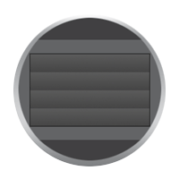
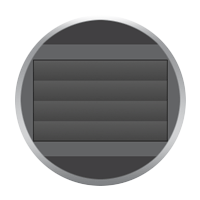

צילום הוא כידוע, רישום האור, וכשהאור הטבעי אינו מספק, מסיבה זו או אחרת, אנו נאלצים להעזר בתאורה מלאכותית. 
בעזרת תאורה נכונה ניתן לייצר כמעט כל אפקט רצוי בצילום, אולם הנושא מורכב וחורג ממסגרת המאמר הזה בו נתרכז בעקרונות הבסיסיים של שימוש בפלאש. 
  
  
## קצת היסטוריה
תאורה מלאכותית יכולה להיות קבועה, כמו כל מנורה או פנס, אבל במקרה של צילום סטילס, שבדר"כ נמשך עשיריות שניה בודדות, היא יכולה גם להיות מבזיקה. 
היתרון הגדול של תאורת הבזקה הוא ביכולת לייצא עוצמת אור גבוהה מאוד ממכשיר בעל מימדים, משקל, צריכת אנרגיה והתחממות קטנים משמעותית מאשר אפשרי בתאורה קבועה.  
תוספת תאורה מלאכותית בצילום היא ותיקה כמעט כמו הצילום עצמו. בתחילה השתמשו באבקה של מגנזיום ואשלגן כלורי וכשהציתו את התערובת נוצר פיצוץ שפלט הרבה אור. 
תערובת דומה משמשת גם היום בזיקוקים. בהמשך, עברו לנורות פלאש חד פעמיות, שהיו בטוחות לשימוש הרבה יותר, אך היו יקרות מאוד לשימוש ולא איפשרו שליטה מדוייקת בעוצמת האור.
לקראת סוף המאה ה-20 נכנסו לשימוש הפלאשים האלקטרוניים בהם אנחנו משתמשים גם היום. 
בפלאש אלקטרוני הנורה ממולאת, בדר"כ, בגז קסנון, היא רב פעמית וניתן לשלוט בעוצמת התאורה שלה באופן מדויק מאוד.
  
  
## עקרון היסוד לצילום בפלאש
העיקרון החשוב ביותר שיש לזכור לגבי השימוש בפלאש הוא שזמן ההבזקה קצר ביותר ונע בין כ-1/500 השניה לכ-1/40,000 השניה, בהתאם לעוצמת ההבזק המבוקשת.  
כדי להבין מדוע משך ההבזקה כל כך חשוב ניזכר לרגע בעקרונות היסוד של חשיפה נכונה. כידוע, זמן החשיפה ומפתח הצמצם שולטים על כמות האור שמגיעה לחיישן. 
פתיחה של הצמצם או הגדלת משך החשיפה יגרמו ליותר אור להגיע לחיישן וסגירה של הצמצם או הקטנת משך החשיפה יגרמו לפחות אור להגיע לחיישן. 
כלומר, ישנם שני פרמטרים השולטים על החשיפה, אחד מהם תלוי בזמן והשני לא. כיוון שברוב המקרים משך ההבזקה של הפלאש קצר יותר ממשך החשיפה, 
נוכל להעזר בכך כדי לייצר הפרדה בין השפעת התאורה הסביבתית (Ambiant light) והשפעת התאורה המלאכותית.

השפעת מפתח הצמצם אינה תלויה בזמן ולכן תשפיע באופן זהה גם על התאורה הסביבתית וגם על התאורה המלאכותית.  
השפעת משך החשיפה כן תלויה בזמן ולכן, כל עוד הוא קצר ממשך ההבזק של התאורה המלאכותית, הוא ישפיע אך ורק על התאורה הסביבתית. 
הארכת זמן החשיפה תכניס יותר אור סביבתי לתמונה ותגרום לתאורת הפלאש להיות פחות דומיננטית. קיצור הזמן יכניס פחות אור סביבתי ולכן תאורת הפלאש תהפוך יותר דומיננטית.


## מצב E-TTL
במצב E-TTL המצלמה מודדת את מצב התאורה בסצנה וקובעת כמה תאורת פלאש יש להוסיף באופן אוטומטי. ברוב המצלמות ניתן לווסת את עוצמת הפלאש הנקבעת ע"י המצלמה ע"י שימוש בפיצוי חשיפת פלאש (Flash Exposure Compensation). הגדרה זו פועלת בדומה לפיצוי החשיפה הרגיל (Exposure Compensation אבל שולטת ספציפית על עוצמת הפלאש. כך למשל, אם נקבע פיצוי חשיפת פלאש של EV 1- הפלאש יבזיק בחצי מהעוצמה שהמצלמה חישבה ללא הפיצוי.  
מצב זה מתאים לשימושים כללים שבהם אין לצלם שאיפה לשלוט במאפייני התאורה, לצלמים מתחילים שאינם מנוסים בשימוש בפלאש או במצבים בהם אין מספיק זמן לכוון את הפלאש באופן ידני.

## מצב ידני
במצב ידני ניתן לשלוט על עוצמת ההבזק, מעוצמה מלאה ועד, ברוב הפלאשים, 1/128 מהעוצמה המלאה, כלומר הפרש של 7 תחנות צמצם, ברזולוציה של 1/3 תחנה כל פעם.
בנוסף, בפלאשים בעלי ראש זום ניתן לשלוט ידנית גם במידת הזום כך שלא תהיה בהכרח תואמת לאורך המוקד של העדשה.  
קביעה ידנית של עוצמת ההבזק מאפשרת, בעקיפין, שליטה על משך ההבזק, היבט שהוא קריטי לצורך הקפאת תנועה מהירה. 
ככל שהעוצמה תהיה קטנה יותר כך משך ההבזק יהיה קצר יותר ויאפשר להקפיא תנועה מהירה יותר.
שיקול נוסף בבחירת עוצמת ההבזק הוא זמן הטעינה מחדש. ככל שההבזק יהיה חזק יותר כך יקח לפלאש יותר זמן להטען מחדש לפני שיהיה מוכן להבזיק מחדש. 
לכן במצבים בהם נדרשת סידרה מהירה של תמונות עם פלאש, כמו בצילום מאקרו, יהיה עדיף להשתמש בעוצמה נמוכה כך שלא יהיה צורך להמתין לטעינה מחדש.
לדוגמה, פלאש בעל זמן טעינה של 1 שניה יצטרך להמתין שניה בין שתי חשיפות בעוצמה מלאה אבל יוכל להבזיק 10 פעמים בשניה ברצף, ללא שום הפסקה, בעוצמה של 1/16.

## משך ההבזק
כמו שראינו, משך ההבזק (Flash duration) הוא נתון קריטי לסוגים מסויימים של צילום אבל כדאי לשים לב שעוצמת ההארה אינה קבועה לאורך ההבזק. 
היא מגיעה מהר מאוד לשיא העוצמה ודועכת יותר לאט. ניתן לראות דוגמה אופיינית בגרף הבא:

שיא העוצמה מגיע לאחר כ-1.2 מילישניות (1/850) ומתחיל לדעוך מיד.  
לאחר 2 מילישניות (1/500) העוצמה יורדת ל-50% מהשיא, נהוג לסמן זמן זה ב-T.5.  
לאחר 4 מילישניות (1/250) העוצמה יורדת ל-10% ונהוג לסמן זמן זה ב-T.1. לאחר זמן T.1 העוצמה יורדת לרמות שניתן להתעלם מהן.  
רוב יצרני הפלאשים לאולפנים (Studio light / Strobe) מפרסמים את נתוני ה-T.5 ו-T.1 של הפלאשים שלהם 
אולם יצרני הפלאשים למצלמות (Speedlight / Flash) בדרך כלל מסתפקים בפרסום של טווח זמנים, מהארוך ביותר, 
כאשר הפלאש פועל בעוצמה מלאה, לקצר ביותר, כאשר הוא פועל  בעוצמה הקטנה ביותר האפשרית. 
רובם גם לא מסבירים איזה זמן הם בדיוק מודדים T.1 או T.5 או משהו אחר אבל בדר"כ אפשר להניח שמדובר ב-T.5.  
בהעדר נתונים מדוייקים אין ברירה אלא לנסות, אבל בהחלט אפשר להניח שככול שהעוצמה תהיה נמוכה יותר כך משך ההבזק יהיה קצר יותר.  

## מהירות סינכרון ו-HSS
אחת המגבלות המשמעותיות ביותר בצילום עם פלאש היא מהירות הסינכרון בין הפלאש למצלמה. 
**מהירות הסינכרון** היא המהירות המירבית שבה ניתן לצלם עם פלאש והיא נעה בין 1/180 ל-1/250, בהתאם ליצרן ולדגם המצלמה.
כדי להבין את מקור המגבלה יש צורך להבין איך פועל התריס (Shutter) במצלמה.  
התריס בנוי משני מסכים שנעים על מסילה לאורך ציר ה-Y של החיישן. המסך הראשון מקובע בצד התחתון של החיישן ועולה כלפי מעלה והמסך השני מקובע בצד העליון ויורד כלפי מטה.  

האנימציות הבאות מדגימות שני מצבי פעולה של מנגנון התריס:

| c1                                | c2                                    | c3                                |
|:---------------------------------:|:-------------------------------------:|:---------------------------------:|
|  |  |  |
| חשיפה רגילה                       |  חשיפה קצרה                           | חשיפה קצרה מאוד                   |

* חשיפה רגילה - 
  * במצב ההתחלתי שני המסכים מורמים. המסך הראשון פרוס כלפי מעלה והמסך השני מקופל לבסיסו.
  * כאשר מתחילה חשיפה המצלמה מורידה את המסך הראשון ובכך מתגלה החיישן ומתחיל לקלוט אור.
  * עם תום החשיפה המצלמה מורידה את המסך השני ובכך נחסם החיישן והחשיפה מסתיימת.
  * שני המסכים חוזרים למצב ההתחלתי כדי להכין את מנגניון התריס לחשיפה נוספת. במצלמות mirrorless התהליך מעט שונה אבל ההבדל לא חשוב לצורך הדיון ולכן נתעלם ממנו.
* חשיפה קצרה וקצרה מאוד -
   * במצב ההתחלתי שני המסכים מורמים. זהה לחשיפה רגילה.
   * המסך הראשון מתחיל לרדת. 
   * זמן החשיפה הנדרש קצר מכדי שאפשר יהיה להמתין למסך שיסיים לרדת. לכן המסך השני מתחיל לרדת עוד לפני שהראשון סיים, כך שנוצר חלון הנע על פני החיישן. 
   * לאחר ששני המסכים הגיעו לקצה המסלול הם חוזרים למצב ההתחלתי.
  
במצב של חשיפה רגילה יש רגע בו החיישן חשוף לחלוטין והפלאש יכול לנצל את הרגע הזה כדי להבזיק. **המהירות הגבוהה ביותר בה זה עדיין אפשרי היא *מהירות הסינכרון***
במצבים של חשיפה קצרה אין שום שלב שבו החיישן חשוף לחלוטין כיוון שיש רק חלון צר שחושף את החיישן. במצב זה אין שום רגע שבו הפלאש יכול להבזיק כך שהתאורה תגיע לכל החיישן.
אילו המצלמה היתה מאפשרת הבזקה במצב כזה היתה מתקבלת תמונה עם פס מואר במקום בו עמד החלון בעת ההבזקה ושאר התמונה היתה כהה.  
  
מנגנון HSS - High Speed Sync פותח כדי להתגבר על בעיה זו ולאפשר צילום במהירות גבוהה ממהירות הסינכרון הרגילה. 
במצב זה, במקום לייצר הבזק אחד במלוא העוצמה המבוקשת, הפלאש מייצר סידרה של הבזקים המתואמים באופן כזה שכל פעם שהחלון בין המסכים זז תהיה הבזקה שתאיר את אותו אזור.  
דרך הפעולה של מנגנון ה-HSS מצביעה גם על החיסרון הגדול שלו, עוצמת הפלאש המלאה מתחלקת על מספר הבזקים חלשים יותר ובכך מקטינים את העוצמה האפשרית של הפלאש. 
ככל שמהירות הצילום תהיה גבוהה יותר תדרש סידרה ארוכה יותר של הבזקים חלשים יותר והעוצמה תפגע יותר.

## מסך ראשון ושני - הקפאת תמונה ומריחה
אחד השימושים הנפוצים בפלאש הוא כדי להקפיא תנועה.  

צורה אחת להקפאת תנועה היא כזו שבה מעוניינים לצלם אובייקט בתנועה באופן שיקפיא את התנועה והאובייקט יראה חד. צורה זו נפוצה יחסית ומשמשת החל מצילום מאקרו ועד צילום אירועים. 
כדי להקפיא תנועה נדרשת חשיפה מהירה. במצבים מסויימים המהירות הנדרשת גבוהה מהמהירות האפשרית ע"י המצלמה או תנאי התאורה. 
למשל, צילום התזה של נוזלים, כך שיראו קפואים באוויר וחדים דורש מהירות של 1/2000 לפחות. 
לכאורה ניתן להשתמש במצב HSS אבל במקרים רבים אובדן העוצמה הכרוך בכך אינו מאפשר שימוש בטכנולוגיה הזו. 
במקום זאת, ניתן לצלם במהירות הסנכרון הרגילה של המצלמה, נניח 1/250, ולהסתמך על מהירות ההבזק של הפלאש כדי לקבל בפועל אפקט של חשיפה מהירה הרבה יותר.
השלבים בשיטה זו:
* מהירות הצילום מתחת למהירות הסינכרון של המצלמה.
* מכוונים את המצלמה כאשר הפלאש כבוי כדי להגיע למצב בו התאורה הסביבתית אינה מספיקה כדי להאיר את הסצנה.
* מוסיפים את הפלאש ומכוונים את עוצמתו כדי לקבל את תוספת התאורה הרצויה. 
* אם התנועה עדיין לא קפואה ניתן להקטין את עוצמת הפלאש עד שההבזק יהיה מהיר מספיק, כמובן תוך תיקון הפרמטרים האחרים כדי לפצות על התאורה החלשה יותר של הפלאש.  
  
צורה שניה של הקפאת תנועה היא כזו שבה התנועה מוקפאת אבל ניתן לראות שובל של מסלול התנועה של האובייקט מאחוריו. 
כדי להשיג אפקט כזה יש לצלם בחשיפה ארוכה מספיק כדי ללכוד את התנועה ולסיים בהבזק מהיר של הפלאש, שיקפיא את התנועה ממש לפני סוף החשיפה.  
בדרך כלל הפלאש פועל במצב שנקרא 1st Curtain. במצב זה הוא מבזיק מיד עם הפתיחה המלאה של המסך הראשון. במצב זה עוצמת הפלאש מנוצלת בצורה מקסימלית וגם קטן הסיכון לבעיות סינכרון. 
במצב 2nd Curtain, לעומת זאת, הפלאש ממתין לסוף החשיפה, ומבזיק ממש לפני סגירת המסך השני, כך שמתקבל האפקט הרצוי.  

דוגמא לשני השימושים:

| a                                                                                                     | b                                    |
|------------------------------------------------------------------------------------------------------:|-------------------------------------:|
|                                                                   |  |
| בעזרת השימוש בפלאש יכולתי להשתמש במהירות חשיפה נמוכה יחסית כדי לחשוף את הסצינה וגם להקפיא את התנועה.  | זו אומנם לא הדוגמא המושלמת אבל היא הכי טובה שיש לי. החשיפה הארוכה מציגה את התנועה של התוף והמתופף והפלאש יצר להם מידה מסויימת של חדות. |
  
  
## פלאש ואיזון לבן 
גוון האור של פלאשים אלקטרוניים המשתמשים בנורות ממולאות קסנון, שזה פחות או יותר כולם, הוא כ-5500K, כלומר דומה לגוון האור של יום שמשי. 
כל עוד מצלמים בתנאי תאורה דומים לא נוצרת בעיה אולם כאשר מצלמים בתנאים בהם התאורה הסביבתית שונה באופן מהותי, 
כמו ביום מעונן מאוד או תחת תאורת ליבון נוצרת בעיה של איזון הלבן (White Balance) שלא ניתנת לתיקון בשלב העריכה, אפילו אם מצלמים ב-Raw. במצבים אלו תאורת הפלאש בולטת מאוד לעין ונראית לא טבעית.  
כדי להתמודד עם הבעיה ניתן להשתמש ב"ג'ל"[^1] שהוא פילטר צבעוני המורכב על ראש הפלאש ומשנה את גוון האור בהתאם לגוון הפילטר. 
השימוש בג'ל שמתאים לאופי הסצנה מומלץ ביותר אולם יש לקחת בחשבון שהוא בולע חלק מהאנרגיה של האור ובכך מקטין את עוצמתו ומתחמם בעצמו. בשימוש אינטנסיבי חשוב לוודא שהג'ל לא מתחמם יתר על המידה.

[^1]: כיום כל ה"ג'לים" עשויים מפלסטיק אבל מקור השם הוא בלוחות ג'לטין צבעוני בהם השתמשו בעבר.